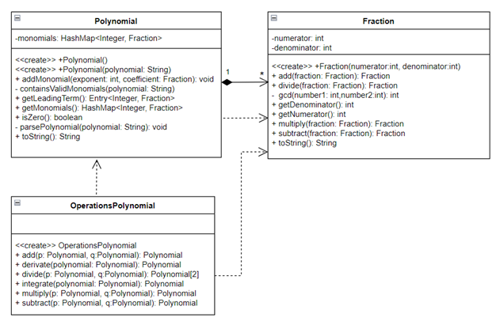

# Polynomial Calculator

## Problem Analysis
The project is a polynomial calculator with a dedicated graphical interface. Users can insert polynomials, select mathematical operations (addition, subtraction, multiplication, division, derivative, integration), and view the result.

### Sub-Objectives
1. Analyze the problem and identify requirements.
2. Design the polynomial calculator.
3. Implement the polynomial calculator.
4. Test the polynomial calculator.

### Functional Requirements
1. Allow users to input polynomials in a standard format.
2. Support basic arithmetic operations on polynomials: addition, subtraction, multiplication, division, derivation, and integration.
3. Allow users to select the mathematical operation they want to perform.
4. Provide clear error messages for invalid inputs or operations.

### Non-Functional Requirements
1. Provide quick responses to user inputs.
2. Ensure an intuitive and easy-to-use user interface.
3. Utilize memory efficiently.

## Classes

### Polynomial Class
The `Polynomial` class contains a list of monomials implemented as a hash map for efficient searching. Key methods include:
- `containsValidMonomials(polynomial: String)`: Checks if a string represents a valid polynomial in one variable using regex expressions.
- `parsePolynomial(polynomial: String)`: Adds monomials from a string to the polynomial.
- `isZero()`: Checks if the polynomial is zero.
- `getLeadingTerm()`: Returns the leading term of the polynomial.

### Fraction Class
The `Fraction` class handles arithmetic operations on fractions, ensuring irreducibility using the greatest common divisor (gcd) method.

### OperationsPolynomial Class
The `OperationsPolynomial` class provides methods for performing arithmetic operations on polynomials:
- `add(p: Polynomial, q: Polynomial)`: Adds two polynomials together.

- `subtract(p: Polynomial, q: Polynomial)`: Subtracts one polynomial from another.
- `multiply(p: Polynomial, q: Polynomial)`: Multiplies two polynomials.
- `derivate(polynomial: Polynomial)`: Computes the derivative of a polynomial.
- `integrate(polynomial: Polynomial)`: Performs the integration of a polynomial.

- `divide(p: Polynomial, q: Polynomial)`: Computes the division of two polynomials.

## Class Diagram

*Class diagram*

